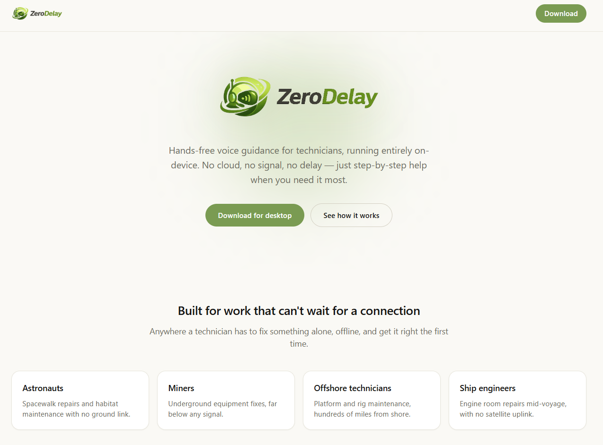
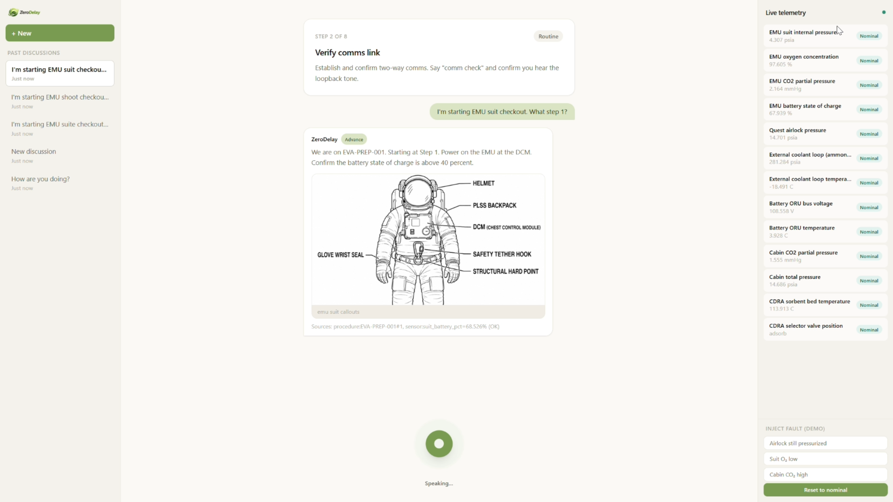

<div align="center">


### A hands-free voice copilot that fixes things where the internet can't reach.

[](#the-track)
[](#why-on-device-is-the-whole-point)
[-7A9B52?style=for-the-badge)](#how-it-works)
[](LICENSE)

</div>

---

**ZeroDelay is a hands-free, on-device voice copilot for technicians doing manual work offline, on-site:** an astronaut on a spacewalk, a miner a kilometre underground, an offshore rig technician, or an engineer in a ship's engine room mid-voyage.

You describe the fault out loud. It walks you through the repair one step at a time, waits for you to confirm each step hands-free, watches the sensors while you work, and stops you *before* you do something dangerous. All of it runs on the laptop or tablet in front of you.

No cloud. No signal. No delay. That's the whole point.

<a id="the-track"></a>
## Built for the Google DeepMind — Edge / On-Device Track

> **The Edge / On-Device Track:** Best mobile, web, or edge application running Gemma locally for offline, privacy-first inference.

This is exactly the constraint ZeroDelay is designed around. The people we built it for don't have flaky internet. They have *no* internet, by definition of where they work. So the model, the speech recognition, the reasoning, the retrieval, and the voice all run locally on a single machine. Cutting the network cable doesn't break it; it's the intended operating condition.

---

## See it in action

<div align="center">

[Watch the ZeroDelay demo on YouTube](https://www.youtube.com/watch?v=6ydUqKCO4Sw)

_Spoken fault in, spoken guidance out — in real time, with the network unplugged._

</div>

<div align="center">
<table>
  <tr>
    <td width="50%"></td>
    <td width="50%"></td>
  </tr>
  <tr>
    <td align="center"><em>The landing page &amp; desktop download</em></td>
    <td align="center"><em>A live, hands-free repair session</em></td>
  </tr>
</table>
</div>

---

## The problem

When a machine breaks in a connected environment, the first thing anyone does is search, call, or ask a chatbot. Field technicians in extreme environments can't do any of that. On a spacewalk, in a deep mine, on an offshore platform, or on a ship mid-voyage, there is no reliable link back to an expert, and their hands are usually full, gloved, or busy holding the thing that's failing.

In those moments the cost of a wrong move is high: damaged equipment, blown schedules, or a genuine safety incident. A cloud AI assistant is useless precisely when it's needed most.

## The solution

ZeroDelay is that expert, running on the device in the room with you.

- **Talk to it, don't type.** Describe the symptom out loud; get spoken, step-by-step guidance back. Confirm each step by voice and keep both hands on the job.
- **It knows the procedure, not just the words.** Repairs are typed, ordered state machines. It tracks where you are, catches skipped or out-of-order steps, and re-routes when the symptoms change.
- **It checks the facts.** Torque values, sensor ranges, part availability, and fault-tree branches come from deterministic lookups, not a guess from the model.
- **It watches your back.** Live sensor readings are checked against safe ranges as you work. Risky steps get an explicit warning and confirmation; if conditions cross a critical line, it halts everything and switches into emergency mode.

<a id="why-on-device-is-the-whole-point"></a>
## Why on-device is the whole point

This isn't a cloud product with an "offline mode" bolted on. It was built offline-first from the ground up.

- **Zero network dependency.** The entire pipeline (speech-to-text, retrieval, reasoning, vision, and text-to-speech) runs locally. After a one-time model download, you can set `ZD_OFFLINE=1`, unplug from the internet, and everything still works.
- **Privacy by construction.** Audio, camera frames, sensor data, and repair logs never leave the machine. There is no telemetry endpoint to leak to, because there's no endpoint at all.
- **Real edge hardware.** The whole stack is tuned to fit a single **8 GB GPU** (it runs on an RTX 3070 / 5060) by loading Gemma in 4-bit. That's a laptop or rugged tablet you can actually carry into the field.
- **No delay.** Once the model is warm, guidance comes back in the moment. No round trip, no waiting on bars of signal that aren't there.

---

## How it works

One multimodal Gemma model does the heavy lifting: speech-to-text, reasoning, *and* reading diagrams. Retrieval only decides *which* procedure applies; the exact numbers come from tool calls, not fuzzy text search.

```
 voice in
    │
    ▼
 Gemma (STT)  ──►  EmbeddingGemma + sqlite-vec retrieval  ──►  which procedure + diagram?
    │                                                                    │
    ▼                                                                    ▼
 prompt = rules + typed steps + live telemetry + tool results + diagram image
    │
    ▼
 Gemma (reasoning + vision)  ──►  structured JSON decision
    │                                   │
    │              needs an exact fact? │  (torque / sensor / inventory / fault branch)
    │                                   ▼
    │                          deterministic tool call ──┐
    │◄──────────────────────────────────────────────────┘  (loop, then commit)
    ▼
 Piper (TTS)  ──►  spoken guidance out
```

Every turn ends in a typed **decision** (`advance`, `block`, `branch`, `escalate`, `emergency`, `clarify`, and friends) carrying the spoken text, the step it applies to, its citations, and a risk note. That structure is what lets the app track procedure state and enforce the safety gate instead of just narrating paragraphs.

### What makes it more than a chatbot

- **Grounded retrieval, deterministic facts.** Vector search picks the procedure; `read_sensor`, `get_torque_spec`, `check_inventory`, and `lookup_fault_tree` supply the exact values from machine-readable reference tables.
- **Typed procedure engine.** Each step carries a safety tier, preconditions, and a verification method (`sensor`, `visual`, or `verbal`).
- **Sees what you see.** The vision model reads equipment schematics directly to help verify a step.
- **Safety-tiered execution.** Routine steps flow; caution and critical steps demand explicit spoken confirmation; a critical sensor reading triggers emergency mode.

---

## Project structure

```
LMT/
├── backend/            FastAPI service — the offline brain
│   ├── agent/          orchestrator, structured-decision schema, prompt builder
│   ├── models/         Gemma runtime, EmbeddingGemma, Piper TTS, voice-activity detection
│   ├── index/          sqlite-vec index builder + retriever
│   ├── tools/          read_sensor / torque / inventory / fault-tree lookups + sensor sim
│   └── api/server.py   HTTP endpoints the frontend calls
├── frontend/           Next.js + Electron desktop app (landing page + hands-free voice UI)
├── data/               Synthetic offline knowledge base
│   ├── procedures/     typed, step-by-step repair manuals
│   ├── diagrams/       schematics the vision model reads
│   └── reference/      telemetry ranges, torque specs, inventory, fault trees
└── assets/             README media
```

The `data/` corpus is **synthetic** (space / EVA / ISS maintenance, authored for the hackathon). It is not real flight documentation and is not for operational use. The schema is deliberately generic, so the same engine drops into mining, offshore, or shipboard work.

---

## Setup

Two pieces: the Python **backend** (the model + pipeline) and the **frontend** desktop app. The backend needs a CUDA GPU; everything is downloaded once (~16–17 GB), then runs fully offline.

> Full, GPU-specific instructions and troubleshooting live in **[`backend/README.md`](backend/README.md)** and **[`frontend/README.md`](frontend/README.md)**. The quickstart below is the short version (Windows / PowerShell).

### 1. Backend

```powershell
# From the repo root
python -m venv .venv
.\.venv\Scripts\Activate.ps1

# Install PyTorch FIRST, matched to your GPU (example: RTX 3070 / cu124).
# See backend/README.md for the RTX 5060 / Blackwell command.
pip install torch torchvision torchaudio --index-url https://download.pytorch.org/whl/cu124

# Install the rest
pip install -r backend\requirements.txt

# Log in once and pull the (gated) Gemma weights — one-time, then offline forever
huggingface-cli login
huggingface-cli download google/gemma-4-E4B-it        # brain: STT + text + vision
huggingface-cli download google/embeddinggemma-300M   # retrieval embeddings
# + one Piper voice into backend\models\piper\  (see backend/README.md)

# Build the offline vector index, then start the API
python -m backend.index.build_index
uvicorn backend.api.server:app --port 8000
```

Prove it's really offline:

```powershell
$env:ZD_OFFLINE="1"   # forbids every network call — now pull the cable
```

Prefer no frontend? The pipeline is fully driveable from the terminal:

```powershell
python -m backend.cli ask "coolant loop pressure is dropping, what do I do?"
python -m backend.cli converse MarsMind\astronaut_query.wav   # voice → STT → agent → spoken reply
```

### 2. Frontend

```bash
cd frontend
npm install
npm run dev          # http://localhost:3000
```

To ship it as a real installable desktop app, `npm run dist:mac` produces a packaged build (details in [`frontend/README.md`](frontend/README.md)).

---

## Tech stack

| Layer | What we used |
| --- | --- |
| On-device model | **Gemma** (E4B-it, with an E2B-it fallback): one multimodal model for STT, reasoning, and vision, in 4-bit via `bitsandbytes` |
| Retrieval | **EmbeddingGemma-300M** + **sqlite-vec** |
| Voice | **Gemma** speech-to-text · **Piper** text-to-speech · Silero VAD |
| Backend | **Python**, **FastAPI**, `transformers`, `sentence-transformers` |
| Frontend | **Next.js** (App Router), **React**, **TypeScript**, **Tailwind CSS**, **Framer Motion** |
| Desktop | **Electron** |

---

## Team

Built at the **RAISE Summit 2026 Hackathon** for the **Google DeepMind — Edge / On-Device Track**.

Licensed under the [MIT License](LICENSE).
